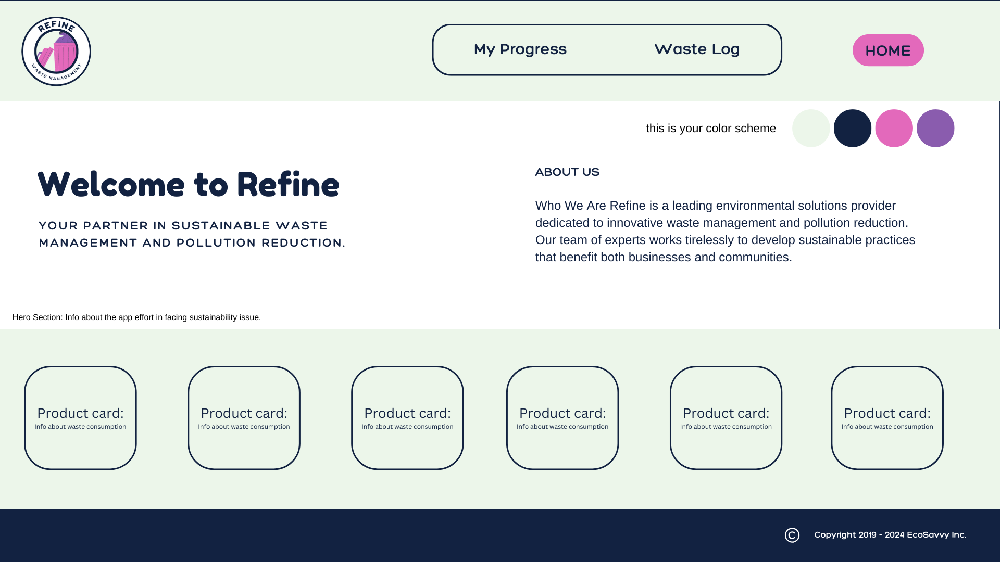
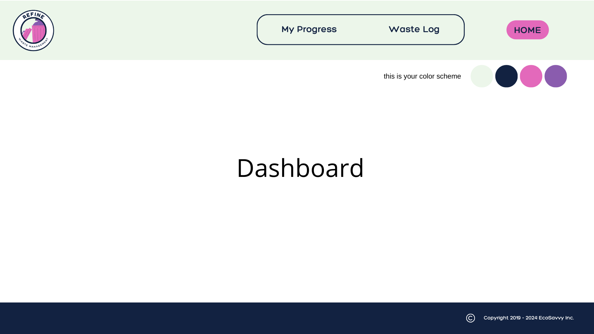
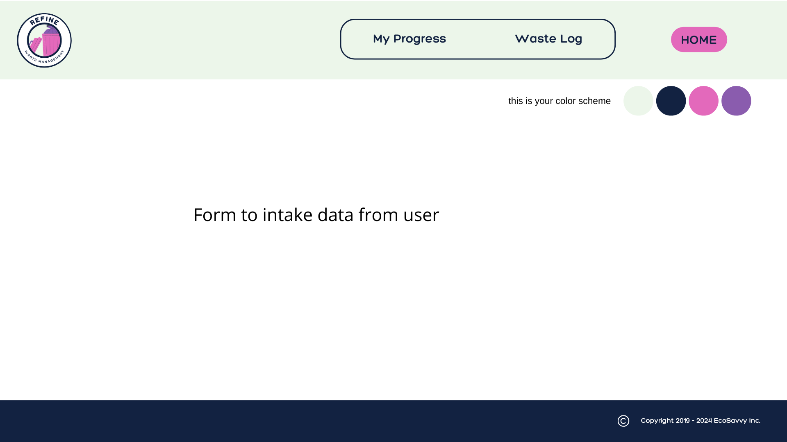

# Refine

## Overview

Refine is a web application designed to promote sustainability by tracking waste usage. This tool aims to empower individuals and organizations to reduce their environmental footprint through comprehensive waste management and insightful analytics. Refine's features will be focusing on helping users to monitor, analyze, and improve their waste habits effectively.

### Problem

Tracking user waste consumption is crucial for generating the data needed to support the circular economy. Currently, there is a lack of detailed, user-specific information in recycling and waste management, which hinders the ability to optimize these processes effectively. By capturing and analyzing data on individual and organizational waste habits, Refine can identify patterns, highlight inefficiencies, and provide actionable insights. This information empowers users to make more sustainable choices and facilitates the development of more efficient recycling systems, ultimately addressing societal pain points in reducing, reusing, and recycling, and building a circular economy.

### User Profile

Refine's primary audience consists of individuals seeking to reduce their waste usage and adopt a healthy and sustainable lifestyle. The app empowers users with tools to track, analyze, and improve their waste management practices, promoting more sustainable choices on a personal level. Refine aims to engineer some of the features for adopt at an organizational level, providing a solution for managing waste at a larger scale. This organizational focus will facilitate more efficient recycling efforts, enhance sustainability practices, and support broader environmental goals, reinforcing Refine's mission to promote the circular economy.
#### Installation Steps

In the project directory,

1. Install dependencies by running:

   ### `npm install`

2. Configure environment variables:

   ### `cp .env.sample .env`

   Update the `.env` file with your database credentials and any other necessary configuration.

3. Clone and set up backend server:

   ### `git clone git@github.com:tina96pham/tina-pham-fullstack-capstone-server.git`

4. Start the server:

   ### `npm start`

### Features

1. The application must have an User-Friendly Interface that is easy-to-navigate for users of all ages and technical backgrounds.
2. The application must have a waste Logging System that allow users to log different types of waste manually.
3. The application must have a personalized Dashboard that shows waste statistics, trends, and areas for improvement.
4. The application has a search function which provide information about different type of waste and their designated disposal location.

## Implementation

### Tech Stack

- Front-End: HTML, SCSS, JavaScript, React
- Back-End: Node.js, Express.js , Knex.js
- Database: MySQL
- Visualization : D3.js
### APIs

List any external sources of data that will be used in your app.

### Sitemap

- HomePage:
    |_Heroes components
    |_Facts about products consumption and waste generate
- Dashboard Page
    |_User's waste consumption
- Waste Logging Page
    |_Form that allow user to log in their waste consumption.

### Mockups

Visuals of your app's screens. You can use tools like Figma or pictures of hand-drawn sketches.
1. Homepage

2. Dashboard Page

3. Waste Logging Page

### Data

Describe your data and the relationships between them. You can show this visually using diagrams, or write it out. 

### Endpoints

List endpoints that your server will implement, including HTTP methods, parameters, and example responses.
/

### Auth

Auth will be a nice to have feature, allowing users to securely access their waste logger and personal dashboard. With secure access, users can manage their data, monitor their progress, and engage with community features, all while maintaining the privacy and integrity of their information. Authentication will be a simple system that uses JWT to encode user information and store it in session storage, protecting user privacy.

## Roadmap

Scope your project as a sprint. Break down the tasks that will need to be completed and map out timeframes for implementation. Think about what you can reasonably complete before the due date. The more detail you provide, the easier it will be to build.
1. Project Folder Setup
2. Set up Static Homepage  
3. Set up Static Form
4. Setup Backend
5. Engineer the database
6. Set up API route
7. Build Handler for Form
8. Build Dashboard
9. Test how diffrent compnents come together and interact.

## Nice-to-haves

1. The application have an authentication that protect user information and ensure data privacy.
2. The application would have a community features that enable users to connect with others, share progress, and participate in community-driven sustainability initiatives.
3. Integrate challenges where user can earn badges, rewards, and leaderboard to motivate users.
4.  The app operates under its own dedicated domain and is deployed on a reliable hosting infrastructure.

## Future Goal
1. Create a Goal Tracker and implementing Streak in the Dashboard to showcase user effort in minimizing their waste
2. Focus on more with user interface to engage user in utilize the app.
3. Add user table and expand the database schema. This will allow authentication and authorization.
3. Growth the database with more waste product information through web scrapping for information.
